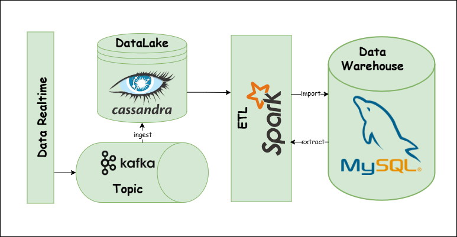

# CDC_Analysis_Recruitment
[](https://spark.apache.org/)
[](https://kafka.apache.org/documentation/)
[](https://cassandra.apache.org/doc/latest/)
[](https://dev.mysql.com/doc/)

## Architecture



## Init
### 1 Installation
This project is built with docker compose, so make sure you have [Docker](https://docs.docker.com/get-started/get-docker/) and docker-compose installed. Follow the steps instructed in Docker to install it. You will also need to install [Apache Spark](https://spark.apache.org/downloads.html) to run the ETL data.

### 2 Strart Services
```python
cd CDC_Analysis_Recruitment && docker-compose up -d
```
When all services are running 


* The structure of data message as below:

```python
root
 |-- create_time: string (nullable = false)
 |-- bid: integer (nullable = true)
 |-- bn: string (nullable = true)
 |-- campaign_id: integer (nullable = true)
 |-- cd: integer (nullable = true)
 |-- custom_track: string (nullable = true)
 |-- de: string (nullable = true)
 |-- dl: string (nullable = true)
 |-- dt: string (nullable = true)
 |-- ed: map (nullable = true)
 |    |-- key: string
 |    |-- value: string (valueContainsNull = true)
 |-- ev: integer (nullable = true)
 |-- group_id: integer (nullable = true)
 |-- id: integer (nullable = true)
 |-- job_id: integer (nullable = true)
 |-- md: string (nullable = true)
 |-- publisher_id: integer (nullable = true)
 |-- rl: string (nullable = true)
 |-- sr: string (nullable = true)
 |-- ts: timestamp (nullable = true)
 |-- tz: integer (nullable = true)
 |-- ua: string (nullable = true)
 |-- uid: string (nullable = true)
 |-- utm_campaign: string (nullable = true)
 |-- utm_content: string (nullable = true)
 |-- utm_medium: string (nullable = true)
 |-- utm_source: string (nullable = true)
 |-- utm_term: string (nullable = true)
 |-- v: string (nullable = true)
 |-- vp: string (nullable = true)
```

|create_time|bid|bn|campaign_id|cd|custom_track|de|dl|dt|ed|ev|group_id|id|job_id|md|publisher_id|rl|sr|ts|tz|ua|uid|utm_campaign|utm_content|utm_medium|utm_source|utm_term|v|vp|
|---|---|---|---|---|---|---|---|---|---|---|---|---|---|---|---|---|---|---|---|---|---|---|---|---|---|---|---|---|
|6d2d8e80-0071-11e...|NULL|Chrome 103|       NULL| 24|       alive|UTF-8|http://localhost:...|CandidatePortal|{publisherId -> 0...|  2|    NULL|NULL|  NULL|TRUE|        NULL|                NULL| 1536x864|2022-07-10 23:57:...|-420|Mozilla/5.0 (Wind...|1-rrc3k5vd-l4o0b4yy|        NULL|       NULL|      NULL|      NULL|    NULL|  1|1018x714|
|49f8ae00-02af-11e...|NULL|Chrome 103|       NULL| 24|       click|UTF-8|http://129.213.68...|CandidatePortal|{customEvent -> c...|  2|    NULL|NULL|  NULL|TRUE|        NULL|                NULL|1920x1080|2022-07-13 20:25:...| 240|Mozilla/5.0 (Wind...|1-eb7odtp7-l4o6dg83|        NULL|       NULL|      NULL|      NULL|    NULL|  1|1920x961|
|b1307ee0-064c-11e...|NULL|Chrome 103|       NULL| 24|        NULL|UTF-8|http://150.136.2....|CandidatePortal|                  {}|  1|    NULL|NULL|  NULL|TRUE|        NULL|                NULL| 1366x768|2022-07-18 10:49:...|-420|Mozilla/5.0 (Wind...|1-m8tpkuds-l4oxward|        NULL|       NULL|      NULL|      NULL|    NULL|  1|1366x625|
|b2425d90-0cae-11e...|   1|Chrome 103|         93| 24|        NULL|UTF-8|http://fe.dev.got...|CandidatePortal|                  {}|  1|    NULL|NULL|   258|TRUE|           1|                NULL| 1366x768|2022-07-26 13:46:...|-420|Mozilla/5.0 (Wind...|1-kntupfok-l61tduvk|        NULL|       NULL|      NULL|      NULL|    NULL|  1|1366x625|
|1f550bf0-049c-11e...|NULL|Chrome 102|       NULL| 24|        NULL|UTF-8|http://150.136.2....|CandidatePortal|                  {}|  1|    NULL|NULL|  NULL|TRUE|        NULL|                NULL| 1280x649|2022-07-16 07:13:...|   0|Mozilla/5.0 (Wind...|1-06i42ohg-l5n4yjj9|        NULL|       NULL|      NULL|      NULL|    NULL|  1|1280x649|

* The `KafkaProducerRecruitF.py` file sends the massage demo data to the Kafka topic `Recruit` and in this project used the Kafka Client `StreamingIntoCass` to receive the message and put it into Cassandra as a DataLake.
